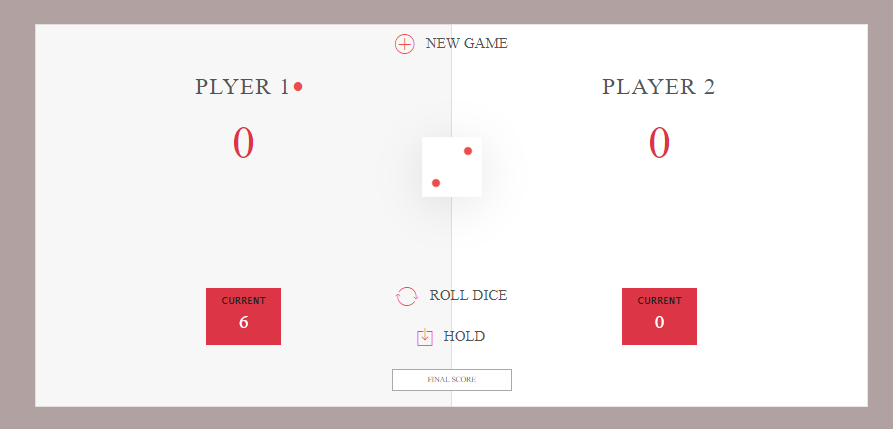

# DiceGame
##### Simple javascript game.
# Template Features:
- js
- Not Responsive
- For Designing tools: HTML,CSS,BOotstramp4
- Very interestng game

# Description:
- Have two Player.
- Final Score: Can set final score for selecting winner
- Hold Button: The dice can change autometically
- New Game: The function used for fresh starting of the match
  

  

Reference: https://www.udemy.com/course/the-complete-javascript-course/learn/lecture/5869168#overview
